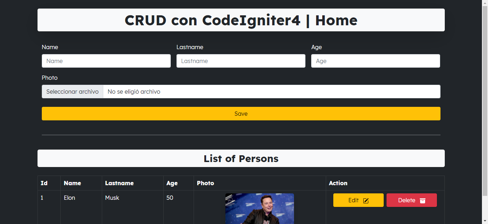

- [CRUD - Codeigniter4](#crud---codeigniter4)
  - [About the project](#about-the-project)
  - [Getting Started](#getting-started)
    - [Prerequisites](#prerequisites)
    - [Installation](#installation)
  - [Usage](#usage)
  - [License](#license)
  - [Contact](#contact)

# CRUD - Codeigniter4

## About the project



This is a simple CRUD created with Codeigniter4. This application has all the features implemented such as create, read, update and delete. It allows to add first name, last name and photo information. It also has validations and is responsive.

## Getting Started

### Prerequisites

- Local Server: XAMPP, WAMP, Laragon, etc.
- PHPMyAdmin

### Installation

1. In the **command line** clone the repository into the folder of local server.
   ```bash
   git clone https://github.com/BryanttV/crud-codeigniter4.git
   ```
2. In the folder **/crud-codeigniter4** update composer.

   ```bash
   composer update
   ```

3. Modificate baseURL in **app/config/App.php**
   ```php
   // Example
   // public  $baseURL  =  'https://crud-codeigniter4.test/';
   public $baseURL = 'your_url';
   ```
4. Create database in **PHPMyAdmin**
   ```sql
   -- Example
   -- CREATE DATABASE crud_codeigniter4
   CREATE DATABASE name_database
   ```
5. Modificate database in **/app/config/Database.php**
   ```php
   public  $default  = [
   'DSN'  =>  '',
   'hostname'  =>  'localhost',
   'username'  =>  'your_user',
   'password'  =>  'your_password',
   'database'  =>  'your_db',
   'DBDriver'  =>  'MySQLi',
   'DBPrefix'  =>  '',
   'pConnect'  =>  false,
   'DBDebug'  => (ENVIRONMENT  !==  'production'),
   'charset'  =>  'utf8',
   'DBCollat'  =>  'utf8_general_ci',
   'swapPre'  =>  '',
   'encrypt'  =>  false,
   'compress'  =>  false,
   'strictOn'  =>  false,
   'failover'  => [],
   'port'  =>  3306,
   ];
   ```
6. Make migrations into the **command line**
   ```bash
   php spark migrate
   ```

## Usage

Access to localhost path and added a new person in the CRUD. Type your name, lastname, age, and upload a image. You can edit and delete the person.

## License

Distributed under the MIT License. See `LICENSE` for more information.

## Contact

Linkedin: [BryanttV](www.linkedin.com/in/bryanttv)

Project Link: [crud-codeigniter4](https://github.com/BryanttV/crud-codeigniter4)
